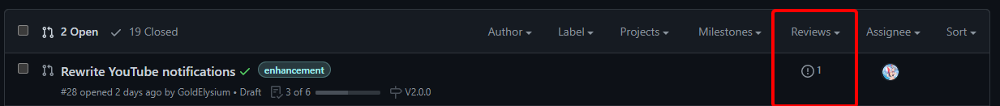

# Contributing guide
**On the team? go to [here](#development-workflow), otherwise keep reading**

Welcome to the Hololive Resort Discord GitHub organization. This organization holds the code for some of our projects.

If you have suggestions for any repository: Feel free to create an issue

You want to contribute: Fork the repo, do your changes and feel free to create a PR (Pull Request).

Tips for when adding new features:

- Comment your code so others will be able to understand it
- Make sure in your PR you should give it a good title and list all the changes you made.
- For commits and PR's follow the [Git Commit Messages](#git-commit-messages) guidelines.

# Development workflow

## Table of contents

[Get started](#get-started)

[GitHub](#github)
- [Repository page](#the-initial-page)
- [Issues page](#issues-page)
- [Pull Requests page](#pull-requests-page)
- [Good to know](#good-to-know)

[GitKraken client](#gitkraken-client)
- [Setting the client up](#setting-up)
- [How to clone a repository](#clone-a-repository)
- [Basic Git actions](#basic-git-actions)

[Git Commit Messages guidelines](#git-commit-messages)

[The actual workflow](#the-workflow-itself)
- [Working on code](#working-on-code)
- [Reviewing someone's PR](#reviewing-someone-else's-code)

## Get started

First of all, download the [GitKraken client](https://www.gitkraken.com/download) and login with your GitHub account.

### Recommended software
These are only examples for if you don't already have stuff installed, all of the software listed is free or has a free version.

#### IDE:
- [Jetbrains IntelliJ IDEA](http://jetbrains.com/idea)
- [Visual Studio Code](https://code.visualstudio.com/)

#### Git clients:
- [GitKraken](https://www.gitkraken.com/)
- [GitAhead](https://gitahead.github.io/gitahead.com/)
    Guide can be found [here](guides/GitAhead.md)

#### Other software:
- [Node.js](https://nodejs.org/en): Since most projects are coded in JavaScript it's useful to have Node.js installed, make sure to choose the [**LTS(Long Term Support)**](https://nodejs.org/en/about/releases/) version. You can easily recognize LTS versions by checking if it's an even number.
- [ESLint](guides/ESLint.md): ESLint has it's own guide

### Useful sites
- [Free for developers](https://free-for.dev/)

#### Website:
- [JS Reference](https://developer.mozilla.org/en-US/docs/Web/JavaScript)
- [Next.JS docs, our framework for React](https://nextjs.org/docs)
- [React docs](https://reactjs.org/docs/getting-started.html)
- [Next Auth](https://next-auth.js.org/getting-started/introduction)
- [Grommet, our design library](https://v2.grommet.io/)

#### Discord bots
- [Discord.JS docs](https://discord.js.org/#/docs/main/stable/general/welcome)

## GitHub

### The initial page

When you open the GitHub repository, you'll likely see something similar to this.
Most of it should speak for itself but here a list anyway:

The branches and tags viewer, this way you can look at the code of someone else is working on (in case of branches) or a specific version (in case of tags).

**Additional notes:**
- Depfu branches are automatically generated every week for dependencies updates
    - But it will not create a new one until the previous has been closed/merged
    - You can let Depfu regenerate the updates and rebase to get more up to date packages and resolve merge conflicts by commenting `@depfu rebase`

### Issues page

This is the issues page, but it also has a few other purposes, here's a list:
- Internal feature requests
- Bugs

If you need help with development, use either Discord or the discussions tab.
If you're not in the organization, for feature requests, also please use the discussions tab.

Make sure to try to use the correct labels whenever you can. If you see an issue that hasn't been assigned to anyone yet, feel free to assign it to yourself if you can do it. Otherwise ask if you can help by commenting.

### Pull requests page

The pull requests page is very similar to the issues page and the thing about labels is the same. Make sure you mark it as a draft if your PR is not ready yet.
The PR will show a red cross, yellow dot or green checkmark behind the name, this shows the status of all the checks. If it's a cross, it's likely that code doesn't comply with our style or for instance the preview deployment or docker image build failed.

While improved from the previous revision over this guide, this bar still isn't really logical. The top bar is the filter, and whatever is below doesn't have to be that.
You might for instance think that there's still one person that needs to review this, while it shows how many issues are linked to this PR.

## Good to know
- You can reference a Pull Request or Issue by using `#<ID>`, the ID can be found under the title on the overview page or next to the title on the issue page.
- In case you don't want to get spammed in your email from GitHub, you can disable the emails for specific notifications in your settings.
- GitHub has markdown, use it for longer issues or comments. Here is a [Cheat sheet](https://github.com/adam-p/markdown-here/wiki/Markdown-Here-Cheatsheet).
- Just as in Discord, you can mention users in a comment, issue or PR by using `@username`

## GitKraken client
### Setting up
After install you'll see this screen, log in using your GitHub account. 

After that setup your profile, the profile name is something only you will see but the name and email you associate with the profile will be public and associated with your commits.
If you don't want your email to be public, you can enable `Keep my email addresses private` in your [Github Settings](https://github.com/settings/emails).
You will be shown an email that you can use in your profile.
If you want to make sure that you never forget to use this private email you can also enable `Block command line pushes that expose my email` in your GitHub settings.

### Clone a repository
After you've logged in and created your profile you're ready to clone a repository.
You can do so by clicking on the `Clone a repo` button and then selecting GitHub.com, next to `Which repository to clone` is a dropdown with a list of all the repositories you have access to.
Select one and select the place you want to store the files.
After you've cloned it will show a notification at the top, open the repository and you should see something like this:

### Basic Git actions
#### Top menu

From left to right:
- Switch repository
- Switch branch (You can also switch branches by doubleclicking on the name in the timeline)
- Undo
- Redo
- Pull, this updates the code on your local machine if there's newer code on GitHub and there's no conflict between your local copy and the newer copy
- Push, after you've committed you code you push it to upload it to GitHub
- Stash, in case there's a conflict and you can't pull but keep your changes, you can stash it. This will remove all changes you've made that aren't committed and save them.
- Pop, pops the latest stash and applies the changes in the stash

#### Committing
After you've made changes you'll see this in GitKraken:

Stage all the files you want to be included in the commit, for the commit message, please follow the [guidelines](#git-commit-messages).
After that, commit and push when ready.

#### Other things
##### Branches
Whenever you create a new branch and push it, you may encounter this:

Just click on submit

##### GPG Signing
For security's sake you (should) can enable commit signing using GPG.
In the settings you can generate a new GPG key, for even better security use a passphrase.
Also enable `Sign Commits by default` and `Sign Tags by default`.
After you've generated it, it'll be selected as your signing key, copy the GPG Public key and add it to your GitHub in the [settings](https://github.com/settings/keys).
If you don't use a GPG key anymore, **DON'T** remove it from your account, it'll turn all your previous signed commits unverified.
Do remove it however if it's compromised. 

## Git Commit Messages

* Use the present tense ("Add feature" not "Added feature")
* Use the imperative mood ("Move cursor to..." not "Moves cursor to...")
* Limit the first line to 72 characters or less
* Reference issues and pull requests liberally after the first line

## The workflow itself

### Working on code
Now you know how the tools work, here is how it generally goes:
1. A feature is requested in Discord or in an issue
2. Let people know you're going to work on it by commenting in Discord or assigning in case of an issue.
3. Create a new branch
4. Start working on it
5. Commit and push
6. Create a PR, make sure to mark it as WIP if it isn't done yet and reference the issue if needed
7. When you're done, let **someone else** review it and merge it

### Reviewing someone else's code
**These are the things you want to look for:**
- Typo's
- Can you understand the code?
- Are the comments enough that you'll still understand it later on?
- Check for trailing whitespaces if possible
- If code is commented out, ask if it can be removed

**Some tips:**
- Select the correct review type
- Look at older PR reviews if you aren't sure if you're doing it correct
- Use multiline comments if it applies to multiple lines of code, you can do this by clicking on the `+` icon on the left side with the line numbers and drag it down until you selected all the lines you need.
-  Use Split mode instead of Unified, otherwise you may encounter issues with multiline comments

In case you still don't understand something, feel free to ask others on Discord. If deemed important enough, it will also get added into this guide.
