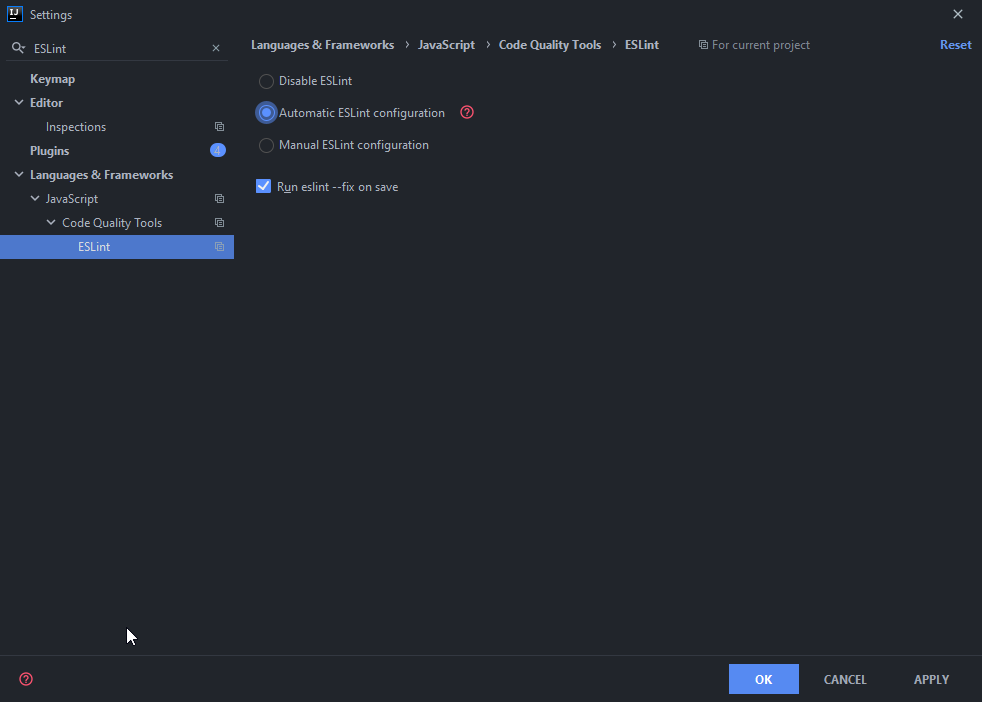

# ESLint setup
ESLint can be used to check syntax, find problems in your code and to enforce a code style.
The code style we use in this organization is from [Airbnb](https://github.com/airbnb/javascript).

## Table of contents
- [Initialize ESLint in a project](#initialize-eslint-in-a-project)
- [Configuring your editor](#configuring-your-editor)


## Initialize ESLint in a project
First install ESLint as a dev dependency by running:
```bash
npm install eslint --save-dev
```

Then run the following command in your project directory:
```bash
npx eslint --init
```
And select the following options:
```bash
✔ How would you like to use ESLint? · style
✔ What type of modules does your project use? · commonjs
✔ Which framework does your project use? · none
✔ Does your project use TypeScript? · No / Yes
✔ Where does your code run? · node
✔ How would you like to define a style for your project? · guide
✔ Which style guide do you want to follow? · airbnb
✔ What format do you want your config file to be in? · JavaScript
```
Clarifications:
- Style = "To check syntax, find problems, and enforce code style"
- For options 2 till 5 choose the applicable setting for your project.

Select yes to install the peer dependencies and afterwards a config file has been generated. 
We will make some changes to the default config:
```js
module.exports = {
	env: {
		browser: false,
		node: true,
		commonjs: true,
		es2021: true,
	},
	extends: [
		'airbnb-base',
	],
	parserOptions: {
		ecmaVersion: 12,
	},
	rules: {
		indent: [2, 'tab'],
		'no-tabs': 0,
	},
};
```
Disable more rules if needed, but only if they pop up a lot in your project.

ESLint will probably give a lot of errors at this point, but luckily it has an auto-fix option that will solve most of the issues. You can use it by running:
```bash
npx eslint --fix .
```

## Configuring your editor
This will only show how to set up IntelliJ IDEA, as I don't know how to set up other editors. I'm also not certain if this also works on community edition as I use ultimate.



Most of the times automatic should work, but in case it doesn't use manual and select node and the correct package location.
Enabling `Run eslint --fix on save` will save you quite some time so I recommend enabling it. 
