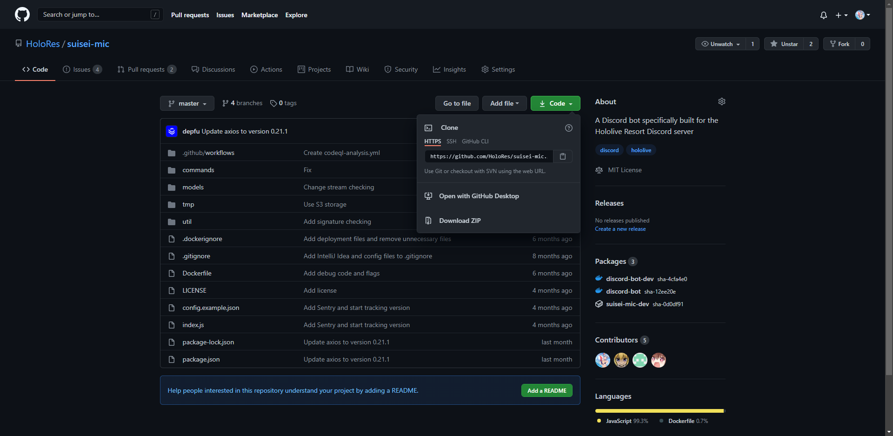
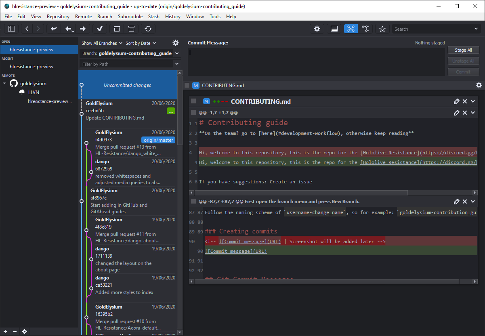

# GitAhead client

## Clone a repository

Under the Code menu you can clone the repository using the URL that is shown here in GitHub by clicking on the clone button

## Top menu

This menu is a really important one. I'll explain most of the buttons here, the ones not explained are either not important or should speak for themselves.

### The Fetch button

This button will fetch changes from GitHub, but not update the files on your local machine.

### The Pull button

This is actually a menu, but you probably won't need to use the items in the menu. Pulling does the same as fetching, but also updates the code on your local machine if there is newer code in GitHub.

### The Push button

When you have committed your files and are ready to push it to GitHub you can push this button. It'll show a number depending on how many commits you are pushing.

When pushing you may encounter this error, click on "push and set the current branch's upstream" and it should get pushed now.

### The Checkout button

If you want to switch to another branch, you can use this button.

### The Stash buttons

You may encounter a moment where you can't pull from GitHub due to a so called "Merge Conflict". In that case you can use the Stash and Pop Stash function if you want to keep your changes. First you Stash your changes by clicking on the left button, after that you pull from GitHub and you can use the Pop Stash button to reapply your changes to the files.

## How to create a new branch

First open the branch menu and press New Branch.

Follow the naming scheme of `username-change_name`, so for example: `goldelysium-contribution_guide`. Also make sure to have "Checkout branch" ticked so that you automatically change to it. Most of the time you want to have master as start point.

## Creating commits

If you made changes to files, it'll show "Uncommittted changes" in the git timeline. Write a commit message with a title on the first line, skip a line and then you can put a detailed message if needed. Sometimes only a title is enough.

Click on stage all if you want to commit all the files you've changed, otherwise select the files or even the lines that you want to commit. After you've done that you can commit and push it.
